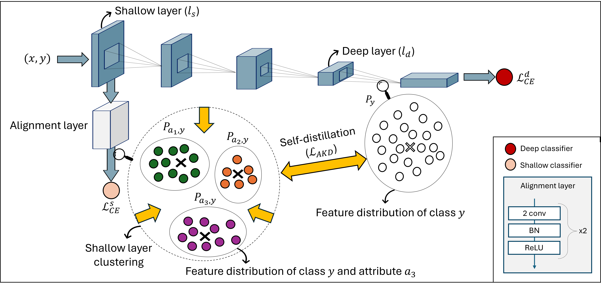

# WACV 2025: Debiasify  
**Official implementation of "Debiasify: Self-Distillation for Unsupervised Bias Mitigation"**

## Abstract

Simplicity bias poses a significant challenge in neural networks, often leading models to favor simpler solutions and inadvertently learn decision rules influenced by spurious correlations. This results in biased models with diminished generalizability. While many current approaches depend on human supervision, obtaining annotations for various bias attributes is often impractical. To address this, we introduce **Debiasify**, a novel self-distillation approach that requires no prior knowledge about the nature of biases. Our method leverages a new distillation loss to transfer knowledge within the network, from deeper layers containing complex, highly predictive features to shallower layers with simpler, attribute-conditioned features in an unsupervised manner. This enables Debiasify to learn robust, debiased representations that generalize effectively across diverse biases and datasets, improving both worst-group performance and overall accuracy. Extensive experiments on computer vision and medical imaging benchmarks demonstrate the effectiveness of our approach, significantly outperforming previous unsupervised debiasing methods (e.g., a 10.13% improvement in worst-group accuracy for Wavy Hair classification in CelebA) and achieving comparable or superior performance to supervised approaches. 

Our code is publicly available at the following link: [Debiasify](#).

---

## Execution Details

### Requirements

- **Python 3**
- **GPU**: Titan XP
- **PyTorch**: 1.6
- **CUDA**: 10.1

#### 1) Download Dataset

- **CelebA**: [link](#)
- **Waterbirds**: [link](#)
- **Fitzpatrick**: [link](#)

#### 2) Execution Command

The README file will be updated after acceptance with detailed execution commands.

## Citation 
Please consider citing our paper. Thanks!

@inproceedings{bayasi2025debiasify, 
title={Debiasify: Self-Distillation for Unsupervised Bias Mitigation}, 
author={Bayasi, Nourhan and Fayyad, Jamil and Hamarneh, Ghassan and Garbi, Rafeef and Najjaran, Homayoun}, 
booktitle={2025 IEEE/CVF Winter Conference on Applications of Computer Vision (WACV)}, 
pages={3227--3236}, 
year={2025}, 
organization={IEEE} 
}

---
